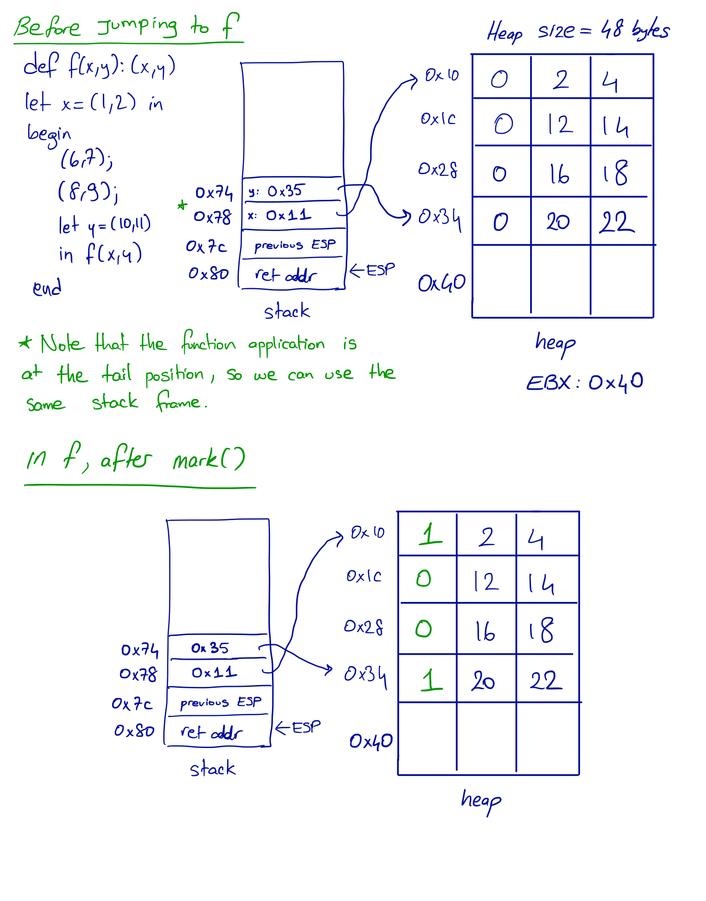
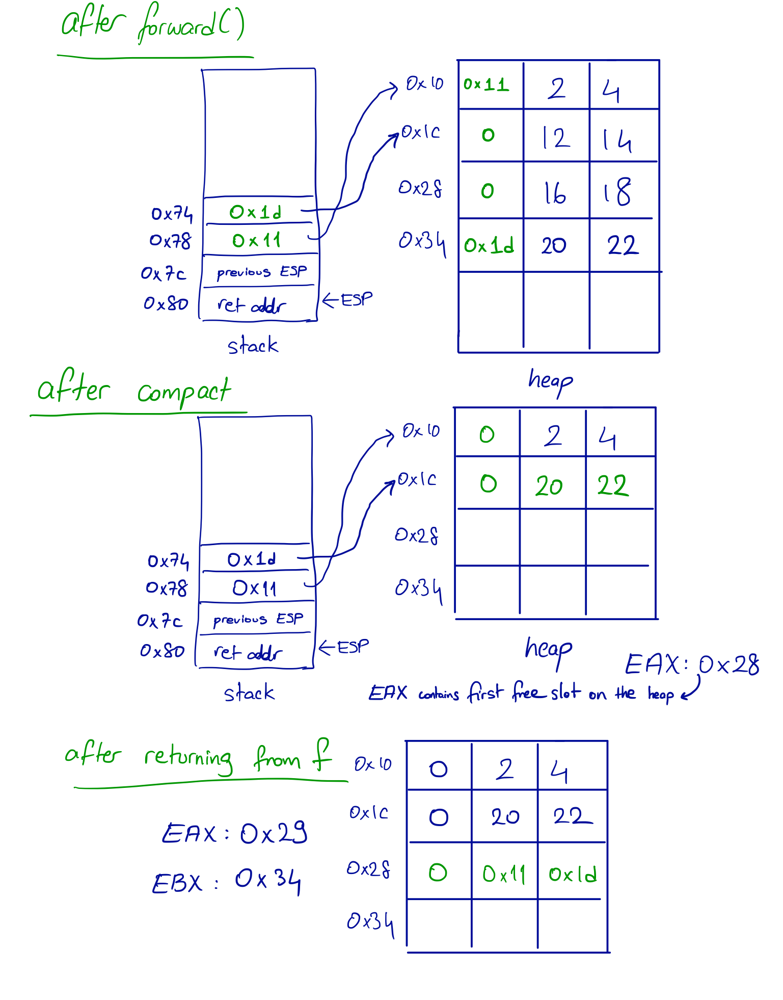

# Garter


## Assignment

[Link to your own repo](/#todo)

The Garter language manages its memory automatically.  You will implement the
automated memory management.

A heads up – there aren't a ton of lines of code needed to complete the lab. I
wrote around 300 lines in `gc.c`. But I also wrote some very complicated tests
in `gctest.c`, and probably spent more time on those than I did on the collector
itself. So give yourself lots of time to carefully think through the cases, and
implement slowly. Test `mark`, `forward`, and `compact` individually and
thoroughly.

## Language

Garter (the language) is much the same as Egg Eater, except with minor
modifications:

1. Replaced variable-length tuples with pairs
2. Pair _assignment_ with the `setfst(t,val)` and `setsnd(t,val)` operators.
   They _update_ the left and right element of a pair respectively. They take 2
   expressions: a tuple and a value to be replaced with. It returns the value of
   the given second argument. For example:
    ```
    let t=(1,2),
        l=setfst(t,3),
        r=setsnd(t,4)
    in  (t,(l,r))
    ```
    should return `((3,4),(3,4))`.

3. Pair _access_ with `fst` and `snd` operators. So rather than using `t[0]` or
   `t[1]`, you should use `fst(t)` or `snd(t)` respectively.
4. `begin` blocks, which allow sequencing of expressions. It returns the value
   of the last expression. There has to be at least one expression in the block.
   For example:
   ```
   let t = (1,2) in
   begin
     setfst(t, 3);
     setsnd(t, 4);
     t;
   end
   ```
   should return `(3,4)`.
     

Their implementation is provided for you. At this point, understanding those
features will be straightforward for you, so the focus in this assignment is
elsewhere.

## Runtime and Memory Model

### Value Layout

The value layout is extended to keep track of information needed in garbage collection:

- `0xXXXXXXX[xxx0]` - Number
- `0xFFFFFFF[1111]` - True
- `0x7FFFFFF[1111]` - False
- `0xXXXXXXX[xx01]` - Pair

  `[ GC word ][ value ][ value ]`

On the heap, each pair has **one additional word** (we will call it the _GC
word_). It is detailed below, and is used for bookkeeping during garbage
collection and printing of self referencing pairs.

### Checking for Memory Usage, and the GC Interface

Before allocating a pair, the Garter compiler checks that enough space is
available on the heap. The instructions should be implemented in `reserve` in
`compile.ml`. If **there is not enough room**, the generated code calls the
`try_gc` function in `main.c` with the information needed to start automatically
reclaiming memory.

If the program detects that there isn't enough memory for the value it's trying
to create, it:

1. Calls `try_gc` with several values:
    - `alloc_ptr`: the current value of EBX (where the next value would be
      allocated without GC)
    - `bytes_needed`: the number of _bytes_ that the runtime is trying to
      allocate
    - `current_ESP`: the current value of ESP (for tracking stack information)
    - `stack_top`: pointer to the last variable on the stack; current top of the
      stack (lowest stack address)

    These correspond to the arguments of `try_gc`.

2. Then expects that `try_gc` either:
   - Makes enough space for the value (via the algorithm described below), and
     returns a new address to use for `EBX`, which should point to the first
     available space in the heap, OR
   - Terminates the program in with an error message `out of memory` if enough
     space cannot be made for the value.

There are a few other pieces of information that the algorithm needs, which the
runtime and `main.c` collaborate on setting up.

To run the mark/compact algorithm, we require:

  - The heap's starting location: This is stored in the global variable `HEAP`
    on startup in `main.c`.

  - The heap's ending location and size: These are stored in `HEAP_END` and
    `HEAP_SIZE` as global variables in `main.c`. We use `HEAP_END` to know where
    to stop searching in the heap.

  - Information about the shape of the stack: We know that in our model of the
    stack frame
    - `[ESP-0]` contains the return address
    - `[ESP-4]` contains the `ESP` value of the previous stack frame,
    - `[ESP-8]` ... `[ESP-(si-1)*4]` contains the current function arguments,
      local variables, temporary variables, etc.
    - `[ESP-si*4]` is the first free spot in the stack

  - The beginning of the stack: This is stored in the `STACK_BOTTOM` variable.
    This is set by the instructions in the prelude of `our_code_starts_here`,
    using the very first value of `ESP`. This is a useful value, it's used to
    limit our search in the stack space.

  - The top of the stack: This is known by our compiler, and always has the
    value of `ESP` at the point of garbage collection.

All of this has been set up for you, but you do to understand why we require
those values. So study `try_gc`, the new variables in `main.c`, and the code in
`compile.ml` that relates to allocating and storing pairs, and implement the
`reserve` function in `compile.ml`.


## Managing Memory

Your work in this assignment is all in managing memory. The bulk of your work
will be done inside `gc.c` and you will write tests in both `gctest.c` and
`myTests.ml`. Fundamentally, you will implement a mark/compact algorithm that
reclaims space by rearranging memory.

### Mark/Compact

The algorithm works in three phases:

1. **Mark**: Starting from all the references on the stack, all of the reachable
data on the heap is _marked_ as live. Marking is done by setting the
least-significant bit of the GC word to 1.

2. **Forward**: For each live value on the heap, a new address is calculated and
stored. These addresses are calculated to compact the data into the front of the
heap with no gaps. The forwarding addresses, which are stored in the remainder
of the GC word, are then used to update all the values on the stack and the heap
to point to the new locations. Note that this step does not yet _move_ any data,
just sets up forwarding pointers.

In addition, addresses on the _stack_ should be updated to reflect these forwarding addresses in this step.

3. **Compact**: Each live value on the heap is copied to its forwarding
location, and has its GC word zeroed out for future garbage collections.

The end result is a heap that stores only the data reachable from the current
stack, in as little space as possible, starting from the front of the heap.
Allocation can proceed from the end of
the compacted space by resetting `EBX` to the first free slot in the heap.

We discuss the three phases in more detail next.

Here's a running example: 
 


The `HEAP_SIZE` is 48 bytes, and we consider the snapshot in time where the `f`
function has just been called.

Four pairs have been allocated so far: one pair stored in `x`, the other two
created in the `begin` expression but unused, and one pair stored in `y`. Each
of these pairs takes up three words; one for the (initially zeroed-out) GC word,
and two for the elements themselves. Overall, the heap is full, and `EBX`
currently points to `0x40`.

The next step would be to allocate space for the pair containing `x` and `y` in
the body of `f`. However, that would require 12 bytes, which is over the limit.
This is why the garbage collector is called.

#### Mark

In the first phase, we take the initial heap and stack, and set all the GC words
of live data to 1. The live data is all the data reachable from references on
the stack, excluding return pointers and base pointers (which don't represent
data on the heap). We can do this by looping over the words on the stack, and
doing a depth-first traversal of the heap from any pairs that we find.

The `stack_top` and `first_frame` arguments to `mark` point to the top of the
stack, which contains a previous `ESP` value, followed by a return pointer. If
`f` had local variables, then they would cause `stack_top` to point higher.
`stack_bottom` points at the highest (in terms of number) word on the stack.
Thus, we want to loop from `stack_top` to `stack_bottom`, traversing the heap
from each reference we find. We also want to _skip_ the words corresponding to
`first_frame` and the word after it, and each pair of `ESP` and return pointer
from there down (if there are multiple function calls active).

Along the way, we also keep track of the highest start address of a live value
(`max_address`) to use later, which in this case is `0x34`, the address of `y`.

#### Forward

To set up the forwarding of values, we traverse the heap starting from the
beginning (`heap_start`). We keep track of two pointers, one to the next space
to use for the eventual location of compacted data, and one to the
currently-inspected value.

For each value, we check if it's live, and if it is, set its forwarding address
to the current compacted data pointer and increase the compacted pointer by the
size of the value. If it is not live, we simply continue onto the next value by
jumping 3 bytes ahead. The traversal stops when we reach the `max_address`
stored above.

Then we traverse all of the stack and heap values again to update any internal
pointers to use the new addresses.

In this case, `y` is scheduled to move from its current location of `0x34` to a
new location of `0x1c`. So its forwarding pointer is set, and both references to
it on the stack are also updated. `x` is already in its final position (starting
at 0), so while its forwarding pointer is set, references to it do not change.

#### Compact

Finally, we traverse the heap, starting from the beginning, and copy the values
into their forwarding positions. Since all the internal pointers and stack
pointers have been updated already, once the values are copied, the heap becomes
consistent again. We track the last compacted address so that we can return the
first free address—in this case `0x28`—which will be returned and used as the
new start of allocation. While doing so, we also zero out all of the GC words,
so that the next time we mark the heap we have a fresh start.

I also highly recommend that you walk the rest of the heap and set the words to
some special value. The given tests suggest overwriting each word with the value
`0x0CAB005E` – the “caboose” of the heap. This will make it much easier when
debugging to tell where the heap ends, and also stop a runaway algorithm from
interpreting leftover heap data as live data accidentally.

(It's straightforward to conditionally include the code that writes this special value using an `IFDEF` for a
production/development split.)

### Testing

This lab has you write tests both of the language and of the underlying garbage
collection algorithm.

**Testing the Language** – You need to add **at least 5 tests** to `myTests.ml`.
These will be automatically evaluated for thoroughness and correctness by
checking if they catch bad implementations.

Testing works mostly as before, except that there are a few additional forms for
checking things relative to the garbage collector. The main program is
parameterized over an integer argument that allows you to select the size of the
heap in terms of (4-byte) words. This is exposed through the testing library as
well, so you can write:

```
tgc "gctest" 10 "(1, 2)" "(1, 2)"
```

and this will run the test with a heap size of 40 bytes.

You can also test for specific errors, for example in the case that there will
never be enough memory to fit the required data:

```
tgcerr "gctest" 8 "(1, (3, (4, 5)))" "out of memory"
```

You can also use `evaluate.sh` to quickly compile and run a given program as
before.

The size of the heap is 400K by default.

**Testing The Collector** – You can write tests for the garbage collector
implementation itself in `gctest.c`, and run them with:

```
> make gctest
> ./gctest
```

This uses the [CuTest](http://cutest.sourceforge.net/) testing framework for C,
augmented with a testing procedure for arrays. You can read the given example to
see how a test is set up: You can add new tests by creating a function of the
same shape as `TestMark`, and adding it with a call to `SUITE_ADD_TEST` at the
bottom.

The given test works by allocating arrays to represent the stack and heap, and
calling `mark`, `forward`, and `compact` on them. The results are checked by
building separate arrays to compare against the heap as it is altered after each
step, with the `CuAssertArrayEquals` function. This function takes a test
context (necessary boilerplate for the testing library), two arrays, and a
length, and compares indices up to that length for equality. Be aware that it
only reports one mismatch in the output.

Feel free to augment this function, or use the other testing functions in CuTest
(see cutest-1.5/README.txt in the repo for the other functions) to test more.

Note that the given test will fail until you implement some of mark, forward,
and compact, as they don't change the heap at all in their initial stubbed-out
versions.

**Printing** – There's a helper, `debug_print_heap`, defined for you in `gc.c`
that takes an array and a number of elements to print, and prints them one per
line like so:

```
  0/0x100df0: 0x1 (5)
  1/0x100df4: 0x0 (0)
  ...
  23/0x100e4c: 0x4 (4)
  24/0x100e50: 0xcab005e (212533342)
```

The first number is the 0-based index from the start of the array, and the
second is the memory address. After the colon is the value, in hex form and in
decimal form (in parentheses). This is a useful layout of information to have at
a glance for interpreting the structure of the heap.

You can also use `debug` which works like `fprintf(stderr, ...)`. You can
disable the debug prints from the these functions by commenting out the line
that contains `#define ENABLE_DEBUG` in `gc.h`.

While automated testing and a debugger are both invaluable, sometimes there's
just no substitute for pretty-printing the heap after each phase in a
complicated test.

To recap, these are the possible errors, and their corresponding error messages:

1. Applying `-`, `+`, `*`, `<`, `>`, `add1`, `sub1`, or `input` to a non-number
   argument: `expected a number`
2. Using a non-boolean value for `if`'s condition: `expected a boolean`
3. Overflow occurs when using `-`, `+`, or `*`, or using a non representable
   number: `overflow`
4. Unbounded variable: `Unbounded variable identifier {id}`
5. Duplicate bindings in a single `let` expression: `Multiple bindings for
   variable identifier {id}`
6. A function application with the wrong number of arguments: `Arity`
7. A function application of a non-existent function: `No such function`
8. A function declaration with duplicate names in the argument list: `Duplicate parameter`
9. Multiple function definitions with the same name: `Duplicate function`
10. If the corresponding argument of `fst`, `snd`, `setfst` or `setsnd` is not a
    pair: `expected a pair`
11. Heap overflow: `out of memory`
12. Argument of `input()` is out of bounds: `input index out of bounds`

### Coverage Testing

We're releasing 6 buggy and 1 working (as far as we know) compiler.

To see the output of all these compilers with your test cases:

1. Log into `ieng6`
2. `cd` to the root of your homework (i.e. `pa6-garter-<github username>`)
3. Run `pa6_coverage_test <program> <heap size> <input 0> <input 1> ...` where
   `<program>` is the string that you want to evaluate, `<heap size>` is the
   size of the heap in words, and rest are inputs to the language. Only
   `<program>` is mandatory. If you've written your program into a file, you can
   use `pa6_coverage_test "$(cat <filename>)" ...`.
4. The corresponding `.s` and `.run` files will be created inside the
   `output{i}` folder, where `{i}` corresponds to the id of the compiler.

## TODO

- `reserve` in `compile.ml`. It should call `try_gc()` which is defined in
  `main.c` with the proper arguments. For starters, make it return an empty
  list. This way you can experiment with the new language first without worrying
  about the GC.
- `mark`, `forward`, and `compact` in `gc.c`. These functions should perform the
  operations described above.
- When you're ready, make the change mentioned in the comment of `try_gc()` in
  `main.c` to trigger your GC.
- Write a bunch of tests in `myTests.ml` and `gctest.c` !!!

A note on support code – a lot is provided, but, as always, you can feel free to
overwrite it with your own implementation if you prefer.

## FAQ

**Q. What is the evaluation order of pairs?**

A. We evaluate the elements of the pair before trying to allocate space for the
resulting pair.

**Q. Can I use a file to store the program of a test case ?**

A. Yes, write your program in `input/<filename>.garter` and in `myTests.ml` you
can use it as `(src "<filename>")` as an argument for `t`, `tgc`, etc.


